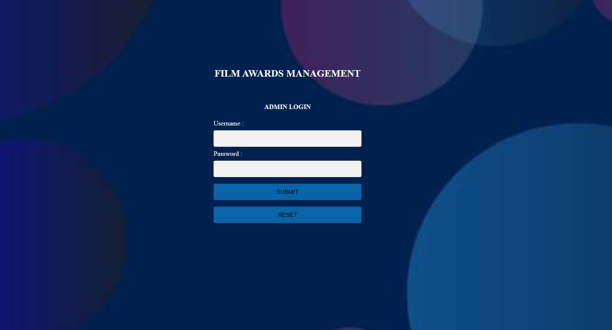
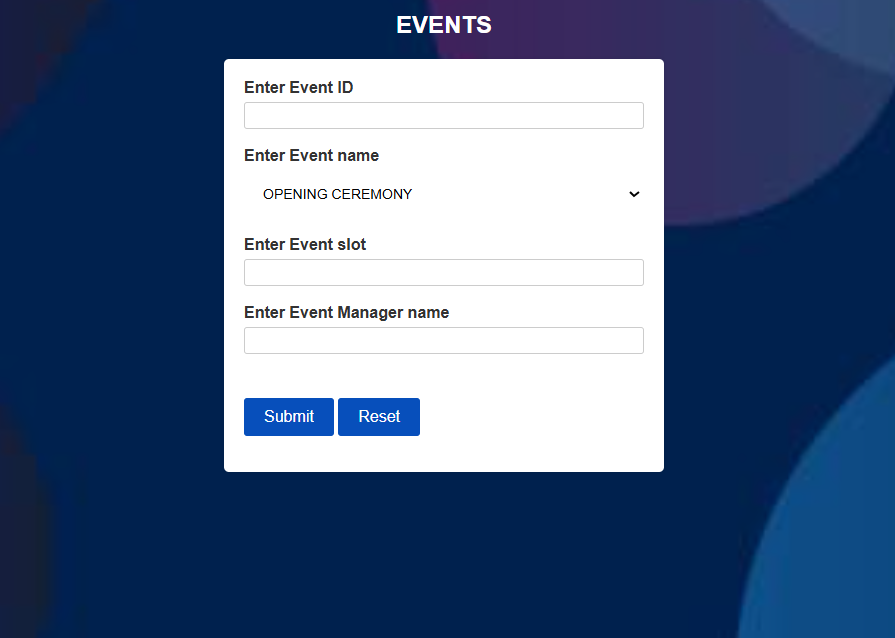
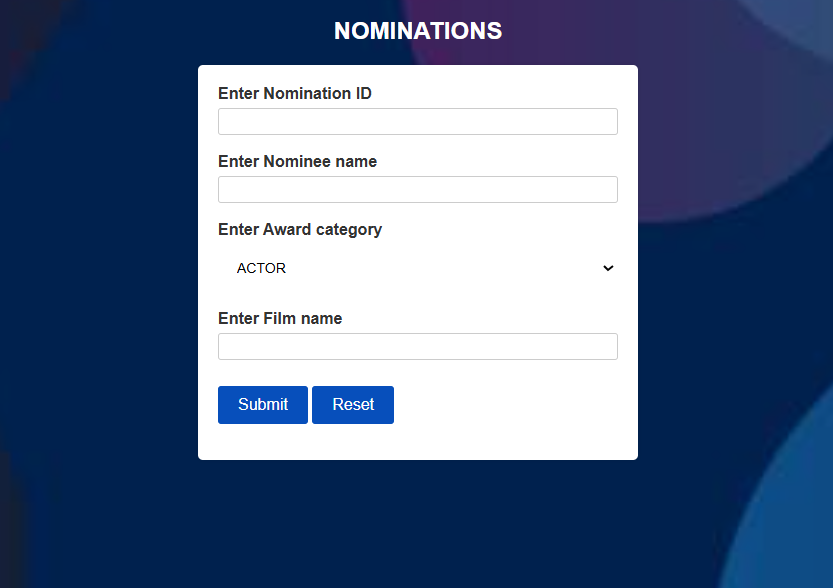
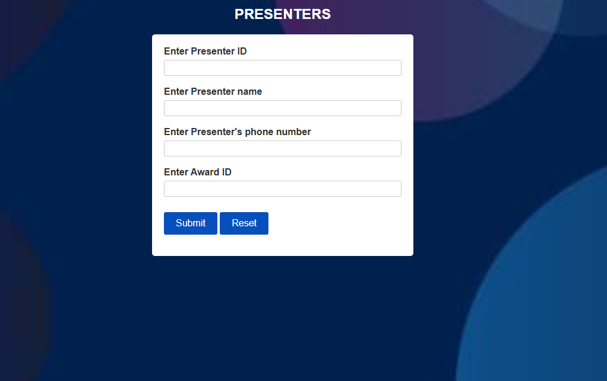

# 🎬 Film Awards Management System
## 📌 Project Overview

✔ Film Awards Management System built using PHP, MySQL, HTML, and CSS to manage film events, nominations, presenters, and awardees.

✔ The Film Awards Management System is a database-driven web application designed to manage and organize information related to film award events.

✔ The system allows administrators to maintain records of films, nominees, presenters, guests, and awardees through an interactive web interface.

✔ This project demonstrates how PHP interacts with a MySQL database to perform operations such as data insertion, retrieval, and display. The application provides structured modules for managing different aspects of film award events.

## 🎯 Project Objectives

- Maintain records of film award events

- Manage nominees, presenters, and guests

- Store and display award results

- Demonstrate database operations using SQL

- Provide a simple web interface for managing film award data

## ✨ Features
### 🎥 Film Management

- Store film details and award information

- Manage award-winning films and nominees


### 🏆 Nomination Management

- Add and display nominees

- Track nominations across different award categories

### 🎤 Presenter Management

- Store and manage information about presenters

### 👥 Guest Management

- Maintain guest records for award events

### 📅 Event Management

- Organize award events and display event details

### 🏅 Awardees Display

- Display final award winners and event outcomes


### 🖥 User Interface

- Simple and interactive web interface

- Separate HTML pages for different modules


## 🧰 Technology Stack


| Category  | Technology |
|-----------|------------|
| Backend   | PHP        |
| Database  | MySQL      |
| Frontend  | HTML       |
| Styling   | CSS        |


## ⚙️ Installation & Setup

Follow these steps to run the project locally.

### 1️⃣ Clone the Repository
```
git clone https://github.com/yourusername/film-awards-management-system.git

```

### 2️⃣ Move Project to XAMPP/WAMP

Copy the project folder to:

```
xampp/htdocs/
```
Example:
```
xampp/htdocs/film_awards
```

### 3️⃣ Start Apache and MySQL

Open XAMPP Control Panel and start:

- Apache

- MySQL

### 4️⃣ Import Database

1. Open phpMyAdmin


2. Create a new database

```
film_awards
```

3. Import the SQL file:

```
film.sql
```

### 5️⃣ Run the Project

Open browser and go to:
```
http://localhost/film_awards/index.html
```


## 📂 Project Structure
```
film_awards/
│
├── awardees.php
├── connect.php
├── display.php
├── event.php
├── event_query.php
├── guest.php
├── guest_query.php
├── nom.php
├── nom_query.php
├── presenter.php
├── presenter_query.php
│
├── event.html
├── guest.html
├── nom.html
├── presenter.html
├── index.html
├── home.html
│
├── film.sql
│
├── query.css
│
└── images
    ├── film.jpeg
    ├── login.jpg
    └── new.jpeg
```


## 📸 Screenshots

### Home Page


### Event Management


### Nomination Module


### Presenter Module



## 🚀 Future Improvements

- Add user authentication system

- Improve UI design with modern frameworks

- Implement search and filtering features

- Add role-based access control

- Create dashboard for event analytics

## 📈 Learning Outcomes

- This project helped demonstrate:

- Database design using MySQL

- Backend development with PHP

- Web page structure using HTML

- Styling using CSS

- Integration between frontend, backend, and database


## 👨‍💻 Author

### Divya H

Software Developer | Python & Web Development Enthusiast

- 💻 Interested in **Full Stack Development**
- 🚀 Passionate about building **real-world web applications**
- 🛠 Skilled in **Python, Django, MERN Stack, and SQL**


GitHub:
https://github.com/divyah0

⭐ If you find this project useful, consider starring the repository to support the project.
